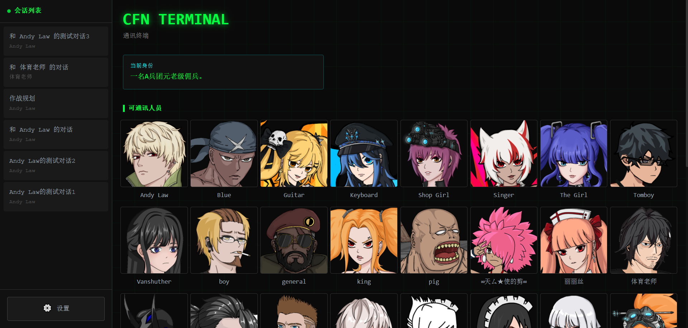

# CFN Terminal

一个与游戏 NPC 进行沉浸式对话的前端终端界面，配合 RAG + Agent 检索后端实现智能 NPC 交互。


## 功能特性

- **沉浸式终端界面** - 赛博朋克风格的聊天界面，支持 NPC 头像与动态立绘展示
- **智能 NPC 对话** - 基于 RAG 检索增强的 NPC 回复，提供上下文感知的交互体验；支持**流式回复**（打字机效果）
- **动作与情绪** - 可输入动作/心理描写，消息中 `【】` 内内容以动作样式展示；支持情绪继承与 NPC 情绪立绘切换
- **好感度系统** - 实时显示 NPC 好感度变化与关系等级，可查询指定 NPC 的好感度接口
- **会话管理** - 多会话并行、切换；支持**删除会话**、**重命名会话**
- **立绘展示** - 立绘布局模式（全局居中 / 右侧对齐 / 右侧居中），支持拖动微调位置
- **角色设定** - 可配置玩家身份（性别、游戏进度等），影响 NPC 对话内容
- **AI 模型与代理** - 自定义 API Key、Base URL、模型名称；可选填代理服务器地址以访问 AI 服务
- **Agent 工具状态与系统通知** - 流式回复期间可展示工具调用进度（`tool_status`），任务草案/发布等系统通知以居中提示展示（`system`）
- **立绘与知识库** - 设置内可补充/重新生成立绘（含从 SWF 导出），可重置知识库（重新生成向量库）

## 技术栈

- **前端框架**: Vue 3 + TypeScript + Vite
- **状态管理**: Pinia
- **样式方案**: Tailwind CSS
- **HTTP 客户端**: Axios

## 快速开始

### 环境要求

- Node.js >= 18
- npm 或 yarn

### 安装依赖

```bash
npm install
```

### 开发模式

```bash
npm run dev
```

开发时前端会将 `/api` 代理到 `http://127.0.0.1:7077`（可在 `vite.config.ts` 中修改），立绘导出等长耗时请求已配置较长超时。

### 构建生产版本

```bash
npm run build
```

## 后端对接

本项目前端默认配套的后端实现为 **CrazyFlashNight** 项目（闪客快打7重置版服务端与工具集），代码仓库地址见：[FlashNightModReborn/CrazyFlashNight](https://github.com/FlashNightModReborn/CrazyFlashNight)。

本项目需要配合 RAG 检索后端使用，后端需提供以下 API：

**会话与对话**

- `GET /api/game/sessions` - 获取会话列表和 NPC 候选
- `POST /api/game/sessions` - 创建新会话
- `DELETE /api/game/sessions/:sessionId` - 删除会话
- `PUT /api/game/sessions/:sessionId/title` - 重命名会话（请求体 `{ "title": "新标题" }`）
- `GET /api/game/history/:sessionId` - 获取会话历史记录
- `POST /api/game/ask` - 发送消息并获取 NPC 回复（非流式）
- `POST /api/game/ask?stream=true` - 流式发送消息（SSE：`content` / `done` / `tool_status` / `system` / `error` 事件）

### SSE 事件约定（/api/game/ask?stream=true）

后端以 Server-Sent Events 推送多类事件，前端按 `event:` 分发解析：

- **content**：`data: {"delta": "..."}`  
  打字机增量，按顺序拼接为最终回复（其中 `【...】` 仍按动作描写解析渲染）。
- **done**：`data: { reply, npc_name, favorability, relationship_level, favorability_change, emotion, ... }`  
  最终整包数据（`reply` 为最终回复文本）。
- **tool_status**：`data: { "text": "...", "tool_name": "..." }`  
  工具调用/思考进度。前端**只展示 `text`**（不展示 `tool_name`）；若 `text` 末尾没有 `…` 或 `...`，会自动补一个 `…` 作为“进行中”提示。
- **system**：`data: { "text": "[任务草案已更新]", "draft_id"?: "...", "task_id"?: "..." }`  
  系统通知（任务拟定/发布等）。前端会将其写入当前 NPC 回复开头，格式为 `{[...]}`
  并以**居中系统通知样式**单独成段渲染（与动作 `【...】` 分离）。
  - 若当前消息仅包含系统块 `{...}`（含换行）而暂未产生对话正文，为避免视觉“空白”，仍会保留 NPC 气泡显示：优先沿用最近一次 `tool_status.text`，否则回退为默认连接提示。

**NPC 与资源**

- `GET /api/game/npc/:npcName/favorability` - 获取指定 NPC 的好感度与关系等级
- `GET /api/assets/avatar/:npcName` - 获取 NPC 头像
- `GET /api/assets/illustration/:npcName/:emotion` - 获取 NPC 立绘
- `POST /api/assets/export-illustrations` - 导出/生成立绘（请求体 `{ "overwrite": boolean }`，从 SWF 导出可能需数分钟）

**知识库**

- `POST /api/game/knowledge-base/reset` - 重置知识库（强制重新生成向量库）

## 配置说明

首次使用需在设置面板中配置：

- **玩家身份** - 设置性别和游戏进度，影响 NPC 对你的称呼和对话内容
- **AI 模型** - 配置 API Key、Base URL 和模型名称（如 OpenAI、Claude 等）
- **代理服务器** - 可选；若需通过代理访问 AI 服务，可填写代理地址，留空则使用系统代理或不使用代理
- **立绘管理** - 可「补充缺失立绘」或「重新生成全部立绘」；立绘可从 illustration.zip 解压或从 SWF 导出（后者需较长时间）
- **重置知识库** - 可强制后端重新生成向量库（如文档或设定变更后）

## 前端使用说明（用户操作指南）

本节面向最终用户，介绍界面功能、操作步骤与注意事项。

### 首次使用前

1. **完成佣兵档案配置**  
   首次打开页面会提示「请先完成佣兵档案配置」。点击 **设置**（左下角）或 **立即配置**，在「佣兵档案配置」中填写：
   - **性别**、**当前进度**（必填），可选填「一句话介绍」（最多 30 字），用于 NPC 对你的称呼与对话内容。
   - **系统配置**：模型名称、API Base、API Key；若需走代理访问 AI，填写「代理服务器地址」。
   - 保存后即可在首页看到「当前身份」预览；未配置时首页会持续提示配置。

### 主界面与会话

- **首页（通讯终端）**  
  左侧为会话列表，右侧为主区域。未选中任何会话时，主区域显示 **可通讯人员**（NPC 列表），点击某个 NPC 头像即可新建与该 NPC 的会话。

- **新建会话**  
  点击 NPC 后弹出「新建会话」弹窗，需输入 **会话标题**（必填，如「和 XXX 的对话」），确认后创建并自动进入该会话。

- **切换会话**  
  在左侧会话列表中点击任意会话即可切换；当前会话会高亮显示（绿色边框）。

- **返回首页**  
  在聊天面板头部点击 **← 返回** 可退出当前会话回到 NPC 列表，不会关闭或删除会话。

- **会话操作（重命名 / 删除）**  
  在会话列表项上 **悬停**，右侧会出现「三点」菜单按钮，点击后可选择：
  - **重命名**：修改该会话的标题（新标识符最多 35 字）。
  - **删除**：删除该会话（通常会有二次确认），**删除后不可恢复**，请谨慎操作。

### 对话与输入

- **发送消息**  
  在底部输入框输入文字（最多 500 字，接近 300 字时会显示字数），按 **Enter** 或点击 **发送** 即可。NPC 回复为**流式输出**（打字机效果），回复过程中请勿重复发送。

- **动作 / 心理描写**  
  输入框上方有一条可展开的 **动作条**（点击左侧小箭头展开/收起）。在动作条中输入的内容会作为「动作」随本条消息一起发送；在**消息正文**中，用 **【】** 包裹的内容也会以动作样式显示（如 `【微微一笑】`）。动作条内容最多 250 字。

- **加载更早消息**  
  在聊天区域顶部有「加载更早消息」按钮，可向上加载该会话的更多历史记录。

### 好感度与立绘

- **好感度**  
  在聊天面板头部会显示当前 NPC 的 **好感度** 与 **关系等级**；好感度变化时会有短暂的增减飘字提示。

- **立绘布局**  
  当该 NPC 有立绘时，聊天区域右上角会出现三个布局模式按钮（仅在有立绘时显示）：
  - **全局居中**：立绘在整体画面居中。
  - **右侧对齐**：立绘贴右侧展开。
  - **右侧居中**：立绘在右侧约 300px 区域内垂直居中（默认）。  
  切换模式会重置立绘的手动偏移。

- **立绘位置微调**  
  在「右侧对齐」或「右侧居中」模式下，可在立绘区域（右侧约 300×600 区域）内 **按住鼠标拖动** 微调立绘上下位置；再次点击布局按钮会清除本次拖动偏移。

- **情绪与立绘**  
  NPC 回复中若带有情绪信息，立绘会随情绪切换；若某情绪无立绘资源，则可能不显示或沿用上一帧。

### 设置面板（佣兵档案与系统）

通过左下角 **设置** 进入，包含：

- **佣兵档案**：性别、当前进度、一句话介绍（影响 NPC 对话与称呼）。
- **系统配置**：模型名称、API Base、API Key；可选「记住 API Key」（会写入本地存储，公共电脑慎用）；代理服务器地址。
- **立绘管理**：  
  - **补充缺失立绘**：只生成当前缺失的立绘（有 illustration.zip 则解压，无则可能从 SWF 导出，耗时较长）。  
  - **重新生成全部立绘**：覆盖并重新生成全部立绘。  
  从 SWF 导成立绘可能需数分钟甚至更久，请耐心等待；完成后建议 **刷新页面**。
- **重置知识库**：强制后端重新生成向量库（例如文档或设定更新后使用）。系统会提示「正在重置知识库，请稍候…」。

**注意事项：**

- 确保系统使用 **UTF-8** 编码，否则解压的立绘文件名可能乱码。
- API Key 若勾选「记住」会保存在浏览器本地，在公共设备上建议不勾选。
- 立绘导出、知识库重置等操作可能耗时较长，请勿在未完成前关闭页面或重复点击。

### 其他说明

- 若「可通讯人员」列表为空，请确认后端已启动且会话/NPC 接口正常；若某 NPC 头像加载失败，该 NPC 可能不会出现在列表中。
- 创建会话或发送消息失败时，请检查网络、后端是否可用，以及是否已正确配置 API Key（或后端 .env）。

## 预览



## License

[MIT](LICENSE)
